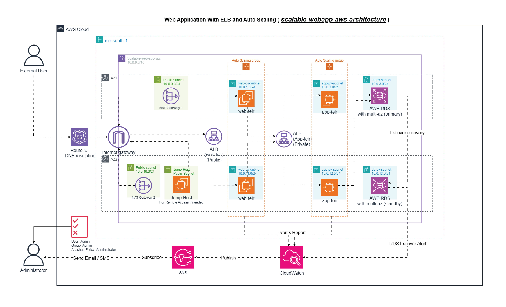

# Scalable Web Application on AWS  
> _Deploying a resilient, high-availability web app with auto scaling and load balancing._

---

<p align="center">
  
</p>

---

## 🚀 High-Level Overview  
This repository illustrates how to build and deploy a simple, **EC2-based** web application on AWS that can automatically scale to meet demand while maintaining high availability. Below is a brief breakdown:

1. **High Availability & Fault Tolerance**  
   - Public Application Load Balancer (ALB) in front of a web tier (stateless EC2 fleet).  
   - Auto Scaling Group (ASG) on the web tier to add/remove instances based on load.  
   - Private Application Load Balancer routing traffic to an app tier (second EC2 fleet).  
   - Amazon RDS (Multi-AZ) for a fault-tolerant, highly available database layer.

2. **Security & Access Controls**  
   - Public subnets host ALBs and NAT Gateways.  
   - Private subnets host web tier and app tier EC2 instances.  
   - A “Jump Host” (bastion) in a public subnet for secure administrative access to private instances.  
   - Fine-grained Security Groups that only open the minimal required ports between layers.

3. **Monitoring & Alerting**  
   - Amazon CloudWatch monitors ASG events, RDS failovers, and instance health.  
   - CloudWatch publishes alerts to an SNS topic.  
   - Administrators subscribe to the SNS topic to receive email/SMS notifications on critical events.

---

## 📋 Table of Contents  
1. [Project Description](#project-description)  
2. [Key AWS Services](#%EF%B8%8F-key-aws-services)  
3. [Architecture Diagram](#%EF%B8%8F-architecture-diagram)  
4. [IAM Roles & Policies](#-iam-roles--policies)  
5. [Security Groups](#-security-groups)  
6. [Project Flow](#project-flow)  
7. [Learning Outcomes](#learning-outcomes)  
8. [Setup & Deployment](#setup--deployment)  
9. [Future Considerations & Questions](#future-considerations--questions)  

---

## 📖 Project Description  
> **Scalable Web Application with ALB & Auto Scaling**  
>  
> **Goal:** Deploy a simple web app across multiple EC2 instances, ensuring it can handle fluctuations in traffic without manual interference.  
>  
> **Core Objectives:**  
> - Implement an **Elastic Load Balancer (ALB)** to distribute incoming HTTP(s) traffic.  
> - Configure an **Auto Scaling Group (ASG)** so that EC2 instances can scale out/in according to real-time demand.  
> - Use **Amazon RDS** (MySQL/PostgreSQL) with **Multi-AZ** deployment for a highly available database backend.  
> - Secure the environment with **IAM roles**, **Security Groups**, and **public/private subnet** design.  
> - Integrate **CloudWatch** monitoring and **SNS** notifications for critical event alerts (e.g., ASG scale-up, RDS failover).

---

## 🛠️ Key AWS Services
- **EC2 (Elastic Compute Cloud):** Hosts the web and application tiers. Instances are launched into Auto Scaling Groups.  
- **Application Load Balancer (ALB):**  
  - **Web-Tier ALB (Public):** Exposes port 80/443 to the internet.  
  - **App-Tier ALB (Private):** Receives traffic only from the web tier on port 5000.  
- **Auto Scaling Group (ASG):** Attaches to each ALB. Monitors instance health and scales based on custom policies (CPU, request count, etc.).  
- **Amazon RDS (MySQL/PostgreSQL, Multi-AZ):** Provides a managed database with automated failover to a standby replica in another Availability Zone.  
- **IAM (Identity and Access Management):**  
  - Enforces a least-privilege model.  
  - Roles for ALB, ASG, and CloudWatch to perform required actions without using root credentials.  
- **Amazon VPC (Virtual Private Cloud):**  
  - **Public Subnets** (for ALBs, NAT Gateways, Jump Host).  
  - **Private Subnets** (for web tier, app tier, and RDS).  
  - **NAT Gateways** (in each AZ) to allow outbound internet updates/patches for EC2 instances in private subnets.  
- **CloudWatch & SNS (Simple Notification Service):**  
  - **CloudWatch Metrics & Events:** Tracks ASG lifecycle events (launch, terminate, failure) and RDS failover events.  
  - **SNS Topic:** Broadcasts alerts to subscribed administrators via email/SMS.

---

## 🗺️ Architecture Diagram  
<p align="center">
  
</p>  
> _Figure 1:_ End-to-end AWS architecture showing highly available, auto-scalable web & app tiers, Multi-AZ RDS, and monitoring/alerting.  

---

## 🔐 IAM Roles & Policies  
Below are the minimum service-linked roles or policies required for each core AWS service.  
1. **ALB (Elastic Load Balancer):**  
   - **Role/Policy:** `AWSElasticLoadBalancingServiceRolePolicy`  
   - **Purpose:** Allows ALB to register/deregister EC2 instances, emit logs, and manage certificates (if using HTTPS).

2. **ASG (Auto Scaling Group):**  
   - **Role/Policy:** `AWSServiceRoleForAutoScaling`  
   - **Purpose:** Grants Auto Scaling permission to launch, terminate, and manage EC2 lifecycle hooks.

3. **CloudWatch:**  
   - **Role/Policy:** `CloudWatchReadOnlyAccess`  
   - **Purpose:** Permits CloudWatch to monitor metrics, read logs, and publish alarms to SNS.

4. **SNS (Simple Notification Service):**  
   - **Policy:** By default, SNS uses a service role—no extra policy needed for email/SMS notifications.  
   - **Administrator User:** Attach custom IAM policy allowing `sns:Publish` to the SNS topic ARN.

---

## 🔒 Security Groups  
| **Component**      | **Inbound**                                       | **Outbound**                                               |
| :----------------- | :------------------------------------------------ | :--------------------------------------------------------- |
| **ALB (Web-Tier)** | `0.0.0.0/0` – TCP 80, 443                          | Private IP range of **Web Tier** subnets (TCP 80, 443)     |
| **Web-Tier EC2**   | ALB (Web-Tier) security group – TCP 80, 443        | ALB (App-Tier) security group – TCP 5000                   |
| **ALB (App-Tier)** | Private IP range of **Web Tier** subnets – TCP 5000 | Private IP range of **App Tier** subnets – TCP 5000        |
| **App-Tier EC2**   | ALB (App-Tier) security group – TCP 5000           | RDS security group – TCP 3306                              |
| **RDS (MySQL)**    | Private IP range of **App Tier** subnets – TCP 3306 | —                                                          |

> _Note:_  
> - All Security Groups follow a “least-privilege” approach.  
> - Each Security Group only allows exactly what’s needed between layers.  
> - Admin (jump host) access is restricted by IP/CIDR to SSH (TCP 22) for troubleshooting.

---

## 🔄 Project Flow  
1. **Client Request (Step 1):**  
   - An external user enters the website domain name.  
   - **Route 53** resolves DNS → forwards to the **Web-Tier ALB** endpoint.  

2. **Web Tier Processing (Steps 2–4):**  
   - The Web-Tier ALB receives the request (via the **Internet Gateway**).  
   - ALB load-balances traffic across healthy **Web-Tier EC2** instances in two AZs.  
   - **Auto Scaling Group (ASG)** monitors instance metrics (CPU Utilization, Request Count per Target) to decide:  
     1. Scale-up if traffic spikes.  
     2. Scale-down when traffic falls.

3. **Application Tier (Steps 5–6):**  
   - Once the web server needs business logic, it makes an internal HTTP call to the **App-Tier ALB** (private DNS).  
   - The private ALB then load-balances among **App-Tier EC2** instances that host the application (e.g., Node.js, Python Flask, etc.).  
   - The app server invokes queries to **Amazon RDS (Primary Endpoint)** on port 3306.

4. **Database Tier & Failover (Step 7):**  
   - RDS is configured in **Multi-AZ** mode:  
     - **Primary** in AZ A (e.g., `10.0.3.0/24`).  
     - **Standby** in AZ B (e.g., `10.0.13.0/24`).  
   - In the event of a primary failure, RDS automatically promotes the standby to primary with minimal downtime.

5. **Monitoring & Alerts (Steps 8–10):**  
   1. **CloudWatch** captures ASG lifecycle events (launch, terminate, failed actions).  
   2. **CloudWatch** also tracks RDS failover notifications.  
   3. These events trigger a **CloudWatch Alarm** → publishes to an **SNS Topic**.  
   4. **Administrator** (or ops team) subscribed to the SNS topic receives an **Email/SMS** alert immediately.

---

## 🎯 Outcomes  
By following this project, you will:  
- **Design & Deploy** a secure, multi-tier web application in AWS.  
- **Implement High Availability** via load balancers and multi-AZ RDS configurations.  
- **Configure Auto Scaling** policies for dynamic, cost-effective resource management.  
- **Lock Down Security** with proper IAM roles, Security Groups, and subnet segmentation (public/private).  
- **Integrate Monitoring & Alerting** to proactively respond to infrastructure events and failures.  
- **Question Best Practices:**  
  - Is our application tier stateless?  
  - Are we over-provisioning NAT Gateways? Could a single NAT with public subnets suffice?  
  - Do our Auto Scaling thresholds align well with real user traffic patterns?  
  - How would blue/green or canary deployments affect this setup?  

---

## 📦 Setup & Deployment  

> **_Prerequisites:_**  
> - An AWS account with permissions to create VPCs, EC2, ALB, RDS, CloudWatch, IAM, and SNS.  
> - Installed and configured AWS CLI (v2) or AWS CloudFormation/Terraform (optional).

1. **Clone this repository locally**  
   ```bash
   git clone https://github.com/abdullahabuslama/scalable-webapp-aws-architecture.git
   cd scalable-webapp-aws-architecture

